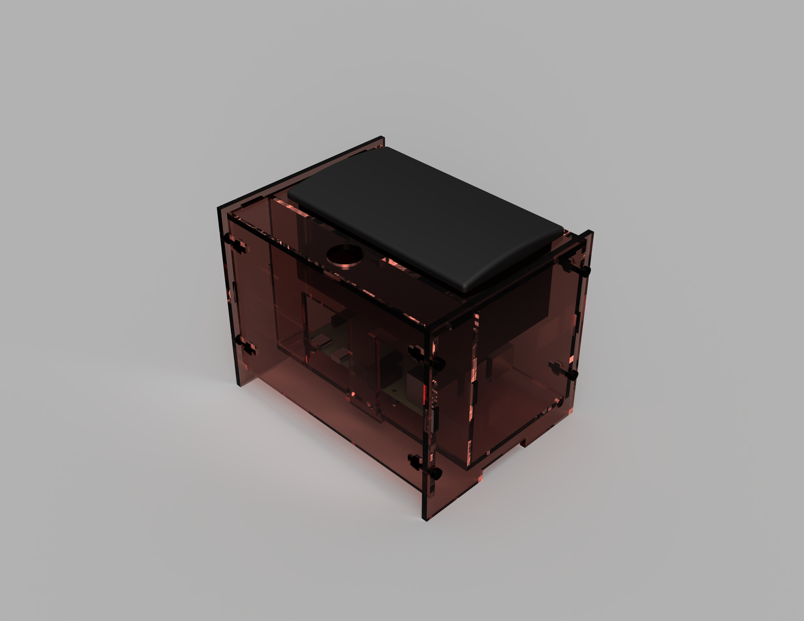

# Thermal Printer

Printer enclosure based on the [Adafruit IoT Pi Printer Project Pack](https://www.adafruit.com/product/1289)

## Details

The Adafruit designs have been reproduced in Fusion 360 and tweaked slightly to remove the rounded corners and add a little more symmetry to the design.

## Credits

- [Raspberry Pi 4 model](https://www.thingiverse.com/thing:3778297)
- Remix of [Adafruit IoT Pi Printer Project Pack - Enclosure](https://www.thingiverse.com/thing:142857).
